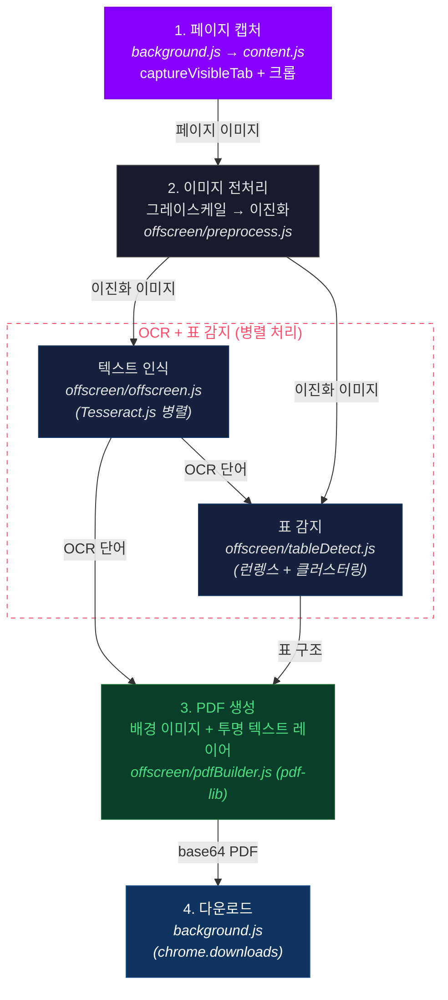

<p align="center">
  
</p>
<p align="center">웹 문서를 캡처하고 OCR 처리하여 검색 가능한 PDF로 변환하는 Chrome 확장 프로그램</p>

---

## 🚀 시작하기

### 1. 사전 요구사항

- **Node.js** 20+
- **pnpm** (`corepack enable && corepack prepare pnpm@latest --activate`)
- **Chrome** 브라우저

### 2. 설치

```bash
pnpm install
```

### 3. 빌드

```bash
# 일회성 빌드
pnpm build

# 파일 변경 시 자동 빌드
pnpm watch
```

### 4. Chrome에 로드

1. `chrome://extensions` 접속
2. 우측 상단 **개발자 모드** 활성화
3. **압축해제된 확장 프로그램을 로드합니다** 클릭
4. `dist` 폴더 선택

### 5. 사용

1. PDF로 변환할 웹 문서 페이지로 이동
2. 브라우저 툴바에서 **Readify** 아이콘 클릭
3. 설정 조정 후 **PDF 생성 시작** 클릭
4. 완료 시 저장 대화상자가 열림

---

## ⚙️ 설정

| 항목 | 설명 | 기본값 |
|:-----|:-----|:-------|
| 파일명 | PDF 저장 파일명 | `Readify` |
| 페이지 범위 | 전체 또는 직접 지정 (시작~끝) | `전체` |
| OCR | 텍스트 인식 활성화 여부 | `ON` |
| 품질 | 이미지 압축 수준 (높음/보통/낮음) | `보통` |

---

## 📖 프로젝트 개요

### 1. 프로젝트 구조

```
📁 readify/
│
├─ 📂 src/
│  ├─ 📜 constants.js ········· 공통 상수 (메시지 타입, OCR/이미지/표 설정)
│  ├─ 📜 background.js ········ Service Worker — 파이프라인 오케스트레이션
│  ├─ 📜 content.js ··········· Content Script — 뷰어 자동 감지 & DOM 스크롤
│  │
│  ├─ 📂 popup/
│  │  ├─ 🌐 popup.html ········ 팝업 UI 마크업
│  │  ├─ 🎨 popup.css ········· 팝업 스타일
│  │  └─ 📜 popup.js ·········· 팝업 로직 (설정, 진행률, 모달)
│  │
│  └─ 📂 offscreen/
│     ├─ 🌐 offscreen.html ···· Offscreen Document
│     ├─ 📜 offscreen.js ······ 메시지 핸들러 + 파이프라인 조합
│     ├─ 📜 preprocess.js ····· 이미지 전처리 (그레이스케일 → 이진화)
│     ├─ 📜 tableDetect.js ···· 표 감지 (런렝스 인코딩 + 클러스터링)
│     └─ 📜 pdfBuilder.js ····· PDF 생성 (이미지 임베드 + 텍스트 오버레이)
│
├─ 📂 icons/ ·················· 확장 프로그램 아이콘 (16 / 48 / 128)
├─ 📂 dist/ ··················· 빌드 결과물 — Chrome에 로드하는 폴더
│
├─ 📄 manifest.json ··········· Chrome 확장 매니페스트 (MV3)
├─ 📜 build.js ················ esbuild 빌드 스크립트
├─ 📄 package.json ············ 패키지 설정
└─ 📄 pnpm-lock.yaml ········· 의존성 잠금 파일
```

### 2. 기술 스택

| 영역 | 기술 | 설명 |
|:-----|:-----|:-----|
| 플랫폼 |  | Manifest V3 기반 |
| 번들러 |  | IIFE 번들링 |
| 패키지 매니저 |  | 의존성 관리 |
| OCR |  | 한국어 + 영어 텍스트 인식 (병렬 처리) |
| PDF 생성 |  | 이미지 + 투명 텍스트 레이어 |
| 폰트 |  | 한글 폰트 임베딩 |

### 3. 실행 절차



### 4. 주요 기능

- **화면 캡처 방식** — `captureVisibleTab`으로 CORS 제약 없이 캡처
- **병렬 OCR** — CPU 코어 수 기반 Tesseract 워커 풀 (최대 8개)
- **표 자동 감지** — 런렝스 인코딩 + 클러스터링으로 표 셀 구조 추출
- **검색 가능한 PDF** — 이미지 위에 투명 텍스트를 겹쳐 검색/복사 지원
- **이미지 품질 선택** — PNG(원본) / JPEG(70%) / JPEG(40%) 압축
- **백그라운드 실행** — 팝업을 닫아도 작업이 계속 진행
- **설정 기억** — 사용자 설정을 `chrome.storage.local`에 자동 저장

---

## 🔐 권한

| 권한 | 용도 |
|:-----|:-----|
| `activeTab` | 현재 탭 캡처 |
| `scripting` | Content Script 주입 |
| `offscreen` | OCR/PDF 처리용 Offscreen Document |
| `downloads` | PDF 파일 다운로드 |
| `storage` | 사용자 설정 저장 |
